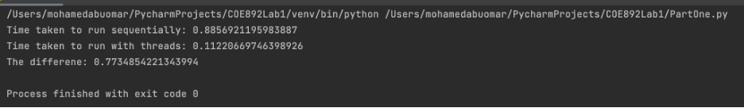
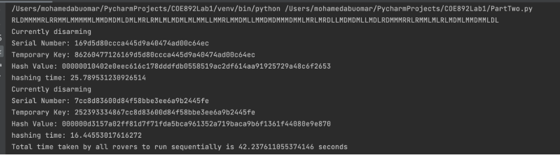
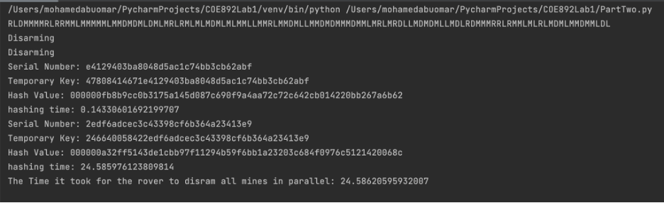

# Concurrency-and-Parallelism-in-Pyhton

## Python Parallel Programming
This project explores the performance differences between running code in parallel versus running it sequentially in Python. The task involves retrieving data from a public API, which includes 10 different land mine detector rovers and their movements.

### Part I
In Part I, the program aims to optimize the execution time of drawing the paths of the rovers on a user-generated map. The map is defined in a text file that includes the dimensions of the map and the location of mines (represented by the number 1). The program generates a separate file for each rover that outlines the path it took on the map. If a rover encounters a mine and fails to disarm it, the program terminates the execution for that rover. The threading module is utilized to implement parallel programming, with 10 threads created to execute the drawing function for each rover.

The Results:

### Part II
Part II of the project focuses on optimizing the computation aspect of disarming the mines. Whenever a rover detects a mine, it generates a unique serial number using the Python uuid library, which is then hashed using the SHA-256 function with a PIN prefix. The program checks whether the resulting hash has a prefix of six leading zeros, and if so, disarms the mine. The multiprocessing module is used to achieve true parallelism since the threading module is limited by the GIL in Python. 

The results for both parallel and sequential attempts are shown below:

## Conclusion
In conclusion, this project aims to compare the performance of running code in parallel versus running it sequentially in Python by implementing two different methods to optimize the execution time of a program that retrieves data from an API and processes it. The result is a faster and more efficient program, which can be used to process large amounts of data in a shorter amount of time.
